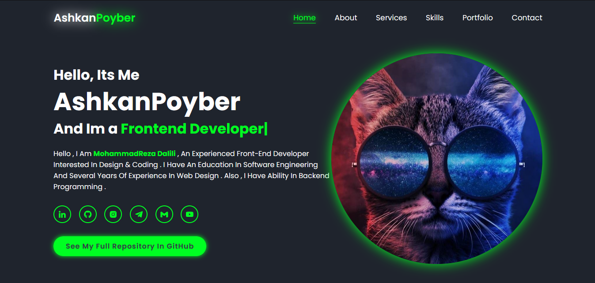

<h1 align="center">
      
    𝑨𝒔𝒉𝒌𝒂𝒏𝑷𝒐𝒚𝒃𝒆𝒓 | 𝑨𝒃𝒐𝒖𝒕𝑴𝒆
      
</h1>

# AshkanPoyber | AboutMe
🛑 Please Pay Attention , This Single Page Website ( Portfolio ) Is Designed To Showcase My Experiences And Talents. If You're Looking For My Other Projects Then [Click Here!](https://github.com/AshkanPoyber?tab=repositories)

# Notice 
🎊 You Can Visit This Web Page ( Portfolio ) With Click Or Search This Link 
https://AshkanPoyber.github.io

# ScreenShots

